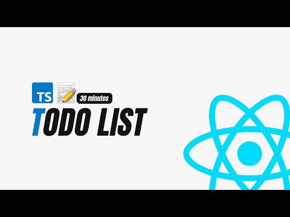
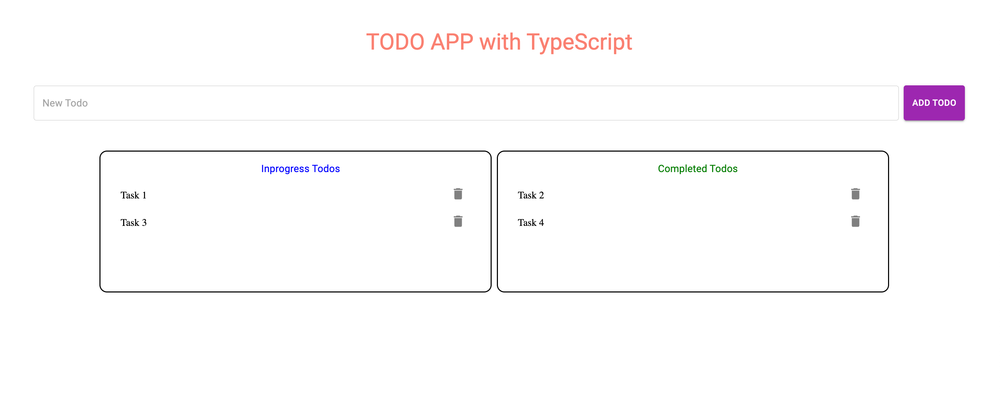

<a name="readme-top"></a>
 
 
<!-- PROJECT LOGO -->
<br />
<div align="center">
  <a href="https://github.com/ibrsec/todoapp-typescript-ui/">
    
  </a>

  <h3 align="center">Typescript Todo App</h3>

  <p align="center">
    An awesome Typescript Todo App
    <a href="https://github.com/ibrsec/todoapp-typescript-ui"><strong>Explore the docs »</strong></a>
    <br />
    <br />
    <a href="https://todoapp-typescript-ui.vercel.app/">View Demo</a>
    ·
    <a href="https://github.com/ibrsec/todoapp-typescript-ui/issues">Report Bug</a>
    ·
    <a href="https://github.com/ibrsec/todoapp-typescript-ui/issues">Request Feature</a>
  </p>
</div>


<!-- TABLE OF CONTENTS -->
<details>
  <summary>📎 Table of Contents 📎 </summary>
  <ol>
    <li><a href="#about-the-project">About The Project</a></li>
     <!-- <li><a href="#figma">Figma</a></li> -->
     <li><a href="#overview">Overview</a></li>
     <li><a href="#quick-setup">Quick Setup</a></li>
     <li><a href="#directory-structure">Directory structure</a></li>
     <li><a href="#built-with">Built With</a></li>
    <!-- <li>
      <a href="#getting-started">Getting Started</a>
      <ul>
        <li><a href="#prerequisites">Prerequisites</a></li>
        <li><a href="#installation">Installation</a></li>
      </ul>
    </li>
    <li><a href="#usage">Usage</a></li>
    <li><a href="#roadmap">Roadmap</a></li>
    <li><a href="#contributing">Contributing</a></li>
    <li><a href="#license">License</a></li>
    <li><a href="#contact">Contact</a></li>
    <li><a href="#acknowledgments">Acknowledgments</a></li> -->

    
  </ol>
</details>


---

<!-- ABOUT THE PROJECT -->
<a name="about-the-project"></a>
## ℹ️ About The Project
  
[](https://todoapp-typescript-ui.vercel.app/) 


<p align="right">(<a href="#readme-top">back to top</a>)</p>


---

<!-- ## Figma 

<a href="https://www.figma.com/file/ePyCHKsx2ODB32uLgyUEEd/bootstrap-home-page?type=design&node-id=0%3A1&mode=design&t=edDzadCB9Ev5FS1a-1">Figma Link</a>  

  <p align="right">(<a href="#readme-top">back to top</a>)</p>


--- -->
<a name="overview"></a>
## 👀 Overview

 
🎯 Used React environment with typescript</br>
🖥 Todos can be added</br>
🖥 Todos status can be changed to completed</br>
🖥 Todos can be deleted</br> 
<!-- 🌱 ÷Screen and search the Legends on the app</br> -->
<!-- 💪   </br> -->
<!-- 🐞 Check the finished tasks   </br> -->


<p align="right">(<a href="#readme-top">back to top</a>)</p>


<a name="quick-setup"></a>
## 🛫 Quick Setup

```sh
# clone the project
git clone https://github.com/ibrsec/todoapp-typescript-ui.git

# enter the project directory
cd todoapp-typescript-ui

# install dependency
npm install || yarn install

# develop
npm run dev || yarn start
```

<p align="right">(<a href="#readme-top">back to top</a>)</p>


<!-- ## 🐞 Debug

 -->


<a name="directory-structure"></a>
## 📂 Directory structure 

```diff
todoapp-typescript-ui  (folder)
  |          
  |---public (folder) 
  |                
+ |---src (folder)    
  |     |---pages (folder)          
  |     |           
  |     |---components (folder)   
  |     |          
  |     |---types.ts
  |     |---App.tsx
  |     |---App.css
  |     |---Index.tsx
  |     └---Index.css
  |         
  |----tsconfig.json
  |----package.json
  |----yarn.lock
  └----readme.md 
```

<p align="right">(<a href="#readme-top">back to top</a>)</p>

---

<a name="built-with"></a>
### 🏗️ Built With

 
<!-- https://dev.to/envoy_/150-badges-for-github-pnk  search skills-->

 
  
  
 <!--   -->
 <!--   -->
  
 <!--   -->
 <!--   -->
 <!--   -->
  
 <!--   -->
 


<p align="right">(<a href="#readme-top">back to top</a>)</p>
